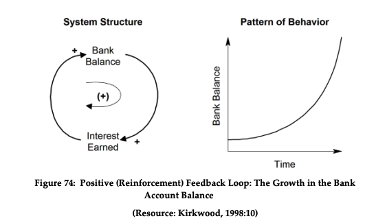
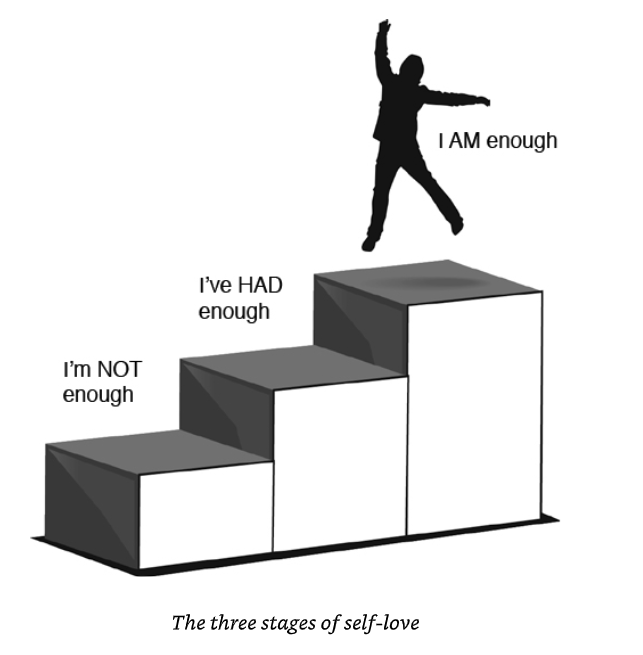
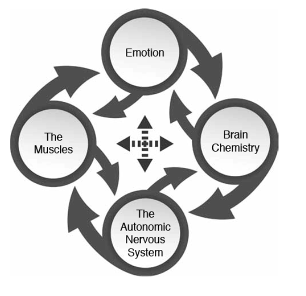

---
# try also 'default' to start simple
theme: default
# random image from a curated Unsplash collection by Anthony
# like them? see https://unsplash.com/collections/94734566/slidev
# background: https://source.unsplash.com/collection/94734566/1920x1080
# apply any windi css classes to the current slide
class: "text-center"
# https://sli.dev/custom/highlighters.html
highlighter: shiki
# show line numbers in code blocks
lineNumbers: false
# some information about the slides, markdown enabled
info: |
  ## I hear me
  Importance of self esteem and the science behind it
# persist drawings in exports and build
drawings:
  persist: false
---

# I Heart Me ❤️

The importance of self esteem and the science behind it.
 
_David R. Hamilton_ [1](https://www.goodreads.com/book/show/21255074-i-heart-me)

---

## Context

David Hamilton is a scientist with a degree in chemistry, working in the pharmaceutical industry for over 4 years. His lack of self-esteem sabotage his life in many ways, so he set himself in a journey to improve his life by writing this book.

Me, I have a bachelor in chemistry and I became a software engineer. Never wrote any book, just this silly presentation.

What we have in common? We are f\*\*\*k.

#### **Same reason why Im giving this presentation**

This book references latest research into brain chemistry, neuroscience and psychotherapeutic techniques. David presents multiple exercices to help anyone interested in having a healthy self-esteem.

<!--Just read. Im reading not just this book, but everything related to psychology-->

---

## What and why?

> **Self-esteem:** One's attitude towards oneself or one's opinion or evaluation of oneself, which may be positive (favourable or high), neutral, or negative (unfavourable or low). Also called self-evaluation. [2](https://www.oxfordreference.com/view/10.1093/oi/authority.20110803100453258)

Self-esteem impacts your decision-making process, your relationships, your emotional health, and your overall well-being. Basically everything

<!--Talk about the feedback loop. Touch the depresion subject-->

---

## Where are you?

- Three stages of self love
  

 

> The key to grown is the introduction of higher dimensions of consciousness into our awareness. _Lao Tzu_

<!--
Talk about the phrase.
Im not enough - Here is where you have a self love deficit. AS the author, he was psycologica bullied, I wasnt bullied but I feel rejected. I felt isolated. Too much rejection. Also, people with low self confidence are more likely to be targeted by others, according to a study.

Ive had enough - This phase is characterized by burst of anger. I remember In high school it was like a traumatic event that made me change my behaviour rapidly. Here is the place where we start feeling free. This was my phase of not giving a flying fuck about anything.

Im enough - Here is where we are actually healthy. We dont need to prove anything to anyone. We are just happy with who we are. No more need of people to like us. Here is where I want to be
-->

---

## Parents

> Research indicates that parenting is a primary predictor of how prone our children will be to shame or guilt. _Brene Brown, Daring Greatly_

- Emotional madurity doesnt come with age
- Environment is important

  - Being shamed
  - Being critized
  - Through observation

- Not about blame

<!--
We all have seen people on their 30 or 40 behaving like children. Specially when you poke in the right spot. Being emotionally mature requires some awareness about one self and practice in how to control our emotions. For most of us, it doesnt come by itself. Is very possible that the parents that we got are not emotioanlly mature which affects their children.

There is no doubt that genetics plays an important role but environment is king. Hamilton explains that we learn about selfesteem from our parents mainly.

* Shaming as corrective behaviour and its consecuences. Parents probably learn this behaviour from their own parents

* Being critized is some ways can be healthy, but if its consistent enough, it could give rise to not being enough. People can become hipersensitive to criticism and perfectionist behaviour

* Through observation - We can also learn though the behaviour of our primary caregiver

This is not about blaming our parents, most of them did it the best as they could. Life has some many circunstances that is imposible for anyone to get it right. Understanding rather tham blame, has to be the way forward for us
-->

---

## Tricks

- Meditation
- Visualization
- Repetition, repetition, repetion.
- Brain <---------> Body - Fake it until you make it
  

---

## Concepts

- Neuroplasticity
- Self compassion
- Why whe are wired to connect
- Authenticity
- Shame
- Body image
- Vulnerability
- Personal gravity / Personal Repulsion
- Forgiveness

---

## Where are you going

- First step is self awareness.
- What do you want to achieve?
- Read and practice
