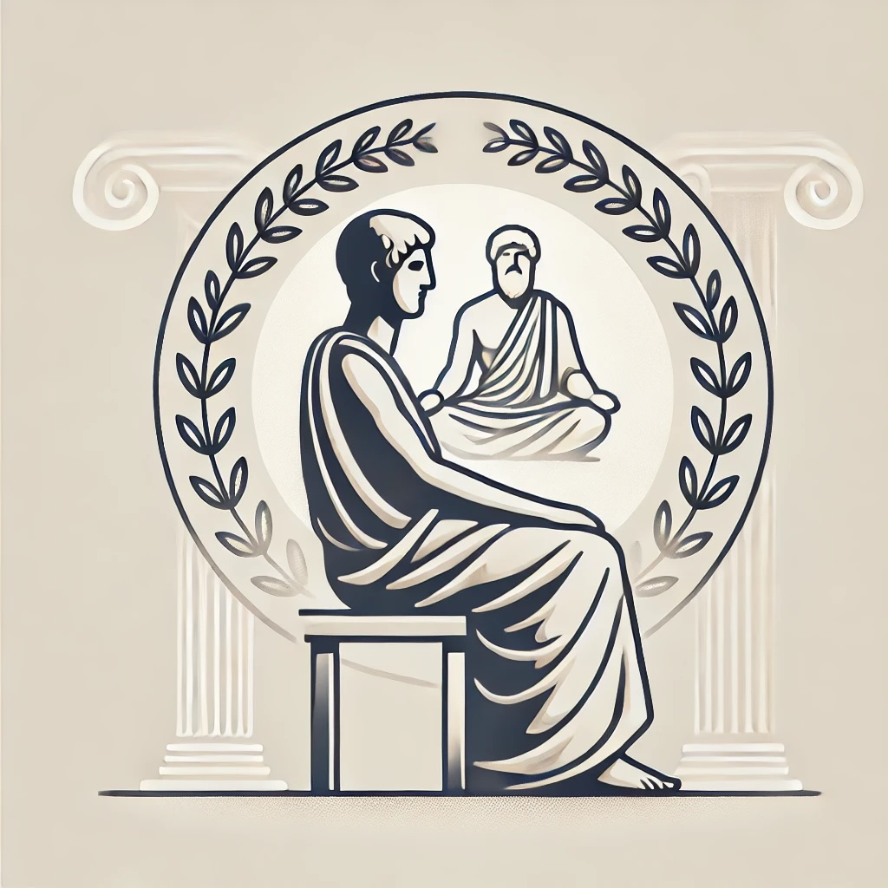
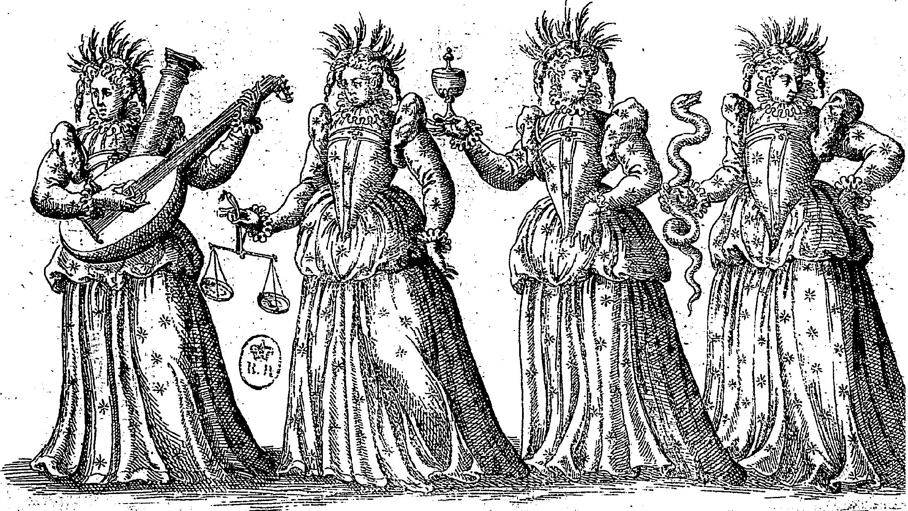
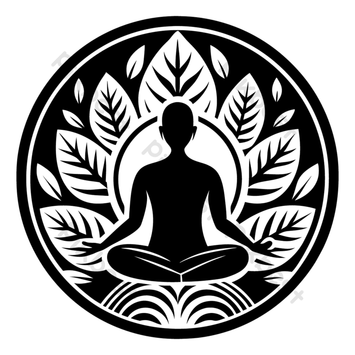

# Stoicism
A guide to a better life

---

## **What is Stoicism?**
Ancient Greek philosophy founded by **Zeno of Citium** (3rd century BC). It goal is to have **a virtuous and tranquil life** through rational control of thoughts and actions.

Focuses on:
+ **Control and Acceptance**
+ **Living Virtuously**
+ **Mindfulness and Perspective**
+ **Harmony with Nature**

---

## **Core Principles of Stoicism**

1. **Control and Acceptance**:  
Focus on what you can control (thoughts, actions) and accept what you cannot (external).  

---

2. **Living Virtuously**:  
   - **Wisdom**: Practical judgment.  
   - **Courage**: Facing fears with strength.  
   - **Temperance**: Practicing moderation.  
   - **Justice**: Treating others fairly.  

---

3. **Mindfullness and Perspective**
   It tries to introduce the practice of being fully aware of your thoughts, emotions, and actions in the present moment.

   It also encourages the ability to view situations from a broader, rational standpoint rather than being consumed by immediate emotions or judgments.

---

4. **Harmony with Nature**
   
  - Living in harmony means accepting the flow of events, both good and bad, as part of this larger order.

  - Stoics emphasize living in harmony not only with nature but also with others, fostering mutual support and cooperation.

  - Avoid excess and live in a way that aligns with your true needs and values, rather than societal pressures or superficial desires.

---

## **Stoic Practices**
      * Negative Visualization (Premeditatio Malorum)
      * Dichotomy of Control
      * Mindful Reflection (Evening Reflection)
      * Voluntary Discomfort
      * Memento Mori (Remember you will die)
      * Practice Gratitude
      * Self-Discipline (Self-Control)
      * Eudaimonia (Flourishing)
      * Stoic Journaling
      * Practice Compassion and Empathy
      * Self-Awareness and Avoiding Ego
      * Focus on the Present

<!--
    Journaling: Morning preparation, evening reflection. 
-->
---

## **How Stoicism Handles Emotions**
1. **Emotions as Natural**:  
Feeling emotions like fear or sadness is human. Stoics aim to prevent impulsive reactions, not deny emotions.

2. **Transforming Perception**:  
Emotions arise from judgments. Reframe events (e.g., a challenge instead of failure) to change emotional responses.

3. **Moderation Over Suppression**:  
Healthy expression is encouraged (e.g., grief is natural but should not consume you). The goal is balance, not denial.

> *“It’s not what happens to you, but how you react to it that matters.”*  
– **Epictetus**

---

# **Conclusion**
- Stoicism teaches us to master our emotions, focus on virtue, and accept life’s challenges.  
- Its practical tools help us live a resilient and fulfilling life.  
- *“The happiness of your life depends upon the quality of your thoughts.”* – Marcus Aurelius